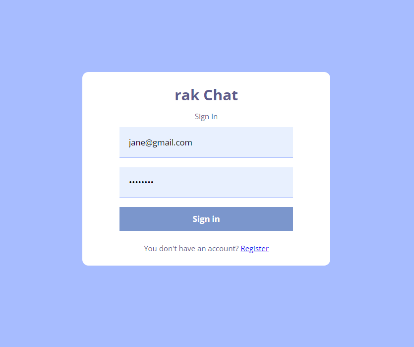
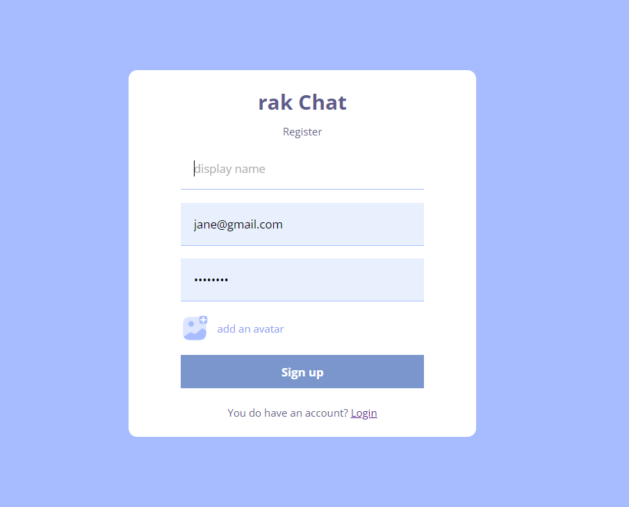
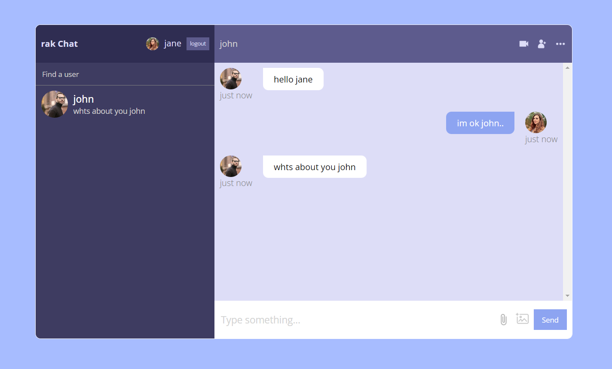
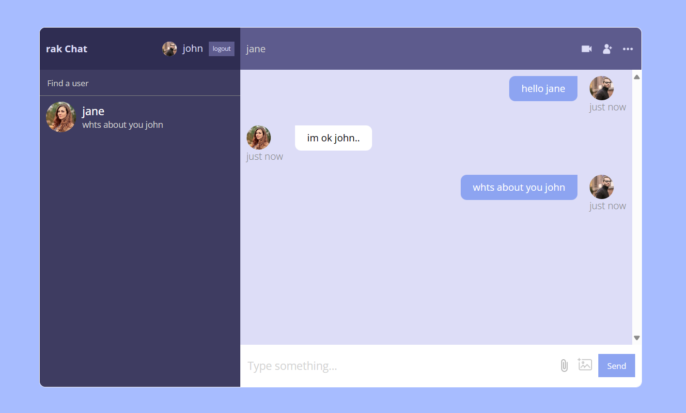

# :closed_book: CHAT App

### _CHAT APP, built using React, Netlify !!_

### Link :link: https://rak-chat.netlify.app/login

## Interface

## Run Locally

  - Run This command `https://github.com/developer-rak/rak_chat.git`
  - You are now in the dev environment and you can play around

## ✨ Features

  - Register / Login
  - Chat Ui
  - Accessibility Between Chats
  - Communicate between chats
  - Open Source (Tweak it and use it)

## ⚙️ Tech Stack
  - HTML5
  - SASS
  - React, Hooks, React Router Dom
  - Firebase, Firebase Authentication, Firebase storage, Firebase Database
  - Netlify
